  
  
  
  
  

## 🚀 What I'm Building Right Now

<table>
<tr>
<td width="50%" valign="top">

### 🖋️ [MindScribe](https://github.com/AbirHasanArko/MindScribe)
Premium blogging/publishing platform with rich-text editing & article management.
`Laravel 13` `Vue 3` `Inertia` `TipTap` `Tailwind`

</td>
<td width="50%" valign="top">

### 🏫 [ClassOS](https://github.com/AbirHasanArko/ClassOS)
Smart classroom attendance: AI face recognition, YOLOv8 head counting, fingerprint auth, Raspberry Pi edge compute.
`Python` `FastAPI` `React` `YOLOv8`

</td>
</tr>
<tr>
<td width="50%" valign="top">

### 🏥 [HelloMed](https://github.com/AbirHasanArko/HelloMed)
Enterprise hospital management & digital health platform — telemedicine, AI health assistant, e-pharmacy.
`Laravel` `Blade` `Oracle PL/SQL`

</td>
<td width="50%" valign="top">

### 🔐 [PassMan](https://github.com/AbirHasanArko/PassMan)
Cross-platform password manager with encrypted vault & biometric auth.
`Java` `JavaFX` `Android`

</td>
</tr>
</table>

## 🛠️ Skills

**Languages**

<table><tr>
<td align="center"> C++</td>
<td align="center"> C</td>
<td align="center"> Java</td>
<td align="center"> Python</td>
<td align="center"> PHP</td>
<td align="center"> TypeScript</td>
<td align="center"> C#</td>
<td align="center"> Dart</td>
</tr></table>

**Web & Frameworks**

<table><tr>
<td align="center"> Laravel</td>
<td align="center"> Vue.js</td>
<td align="center"> React</td>
<td align="center"> FastAPI</td>
<td align="center"> ASP.NET</td>
<td align="center"> Tailwind</td>
<td align="center"> HTML</td>
<td align="center"> CSS</td>
</tr></table>

**Mobile & Cloud**

<table><tr>
<td align="center"> Flutter</td>
<td align="center"> Dart</td>
<td align="center"> Firebase</td>
</tr></table>

**Databases**

<table><tr>
<td align="center"> MySQL</td>
<td align="center"> PostgreSQL</td>
<td align="center"> SQLite</td>
<td align="center"> Oracle PL/SQL</td>
</tr></table>

**AI / Computer Vision**

<table><tr>
<td align="center"> Python</td>
<td align="center"> OpenCV</td>
<td align="center"> PyTorch</td>
<td align="center"> dlib</td>
<td align="center"> Ollama</td>
<td align="center"> Mistral</td>
<td align="center"> RAG</td>
</tr></table>

**Hardware & Embedded**

<table><tr>
<td align="center"> Arduino</td>
<td align="center"> Raspberry Pi</td>
<td align="center"> Verilog HDL</td>
<td align="center"> Fingerprint Sensor</td>
</tr></table>

**Tools & Platforms**

<table><tr>
<td align="center"> Git</td>
<td align="center"> GitHub</td>
<td align="center"> Linux</td>
<td align="center"> VS Code</td>
<td align="center"> Docker</td>
<td align="center"> Jira</td>
</tr></table>

## 📈 Proficiency Levels

<i>Levels are self-rated on hands-on project experience, not certifications — treat them as "how comfortable I am shipping with this," not a formal benchmark.</i>

## 📌 Featured Projects

<table>
<tr>
<td width="50%">

</td>
<td width="50%">

</td>
</tr>
<tr>
<td width="50%">

</td>
<td width="50%">

</td>
</tr>
<tr>
<td width="50%">

</td>
<td width="50%">

</td>
</tr>
</table>

📁 More projects worth a look

 

| Project | Description | Stack |
|---|---|---|
| [KMinds-Website](https://github.com/AbirHasanArko/KMinds-Website) | Full-stack platform for a university AI/ML club | ASP.NET Web Forms |
| [Numerical-Computing-Suite](https://github.com/AbirHasanArko/Numerical-Computing-Suite) | Comprehensive C++ implementations of Numerical Methods with theory | C++ |
| [Image-Editor](https://github.com/AbirHasanArko/Image-Editor) | Lightweight C++ image processing app: blur, grayscale, and classic filters | C++ |
| [ClassOS-legacy](https://github.com/AbirHasanArko/ClassOS-legacy) | Earlier iteration of the ClassOS attendance system | TypeScript |
| [C-Programming](https://github.com/AbirHasanArko/C-Programming) | Basics through advanced C programs | C |
| [Arduino](https://github.com/AbirHasanArko/Arduino) | Arduino programming, from basics to full projects | C++ |

## 🧩 Problem Solving & Competitive Programming

  
  
  
  

## 📊 GitHub Stats

  
  

  

  

### 🐍 Contribution Snake

  

📍 KUET, Khulna, Bangladesh &nbsp;•&nbsp; ⚡ Fun fact: I debug hardware with an oscilloscope and software with `console.log`, and I'm not ashamed of either.

